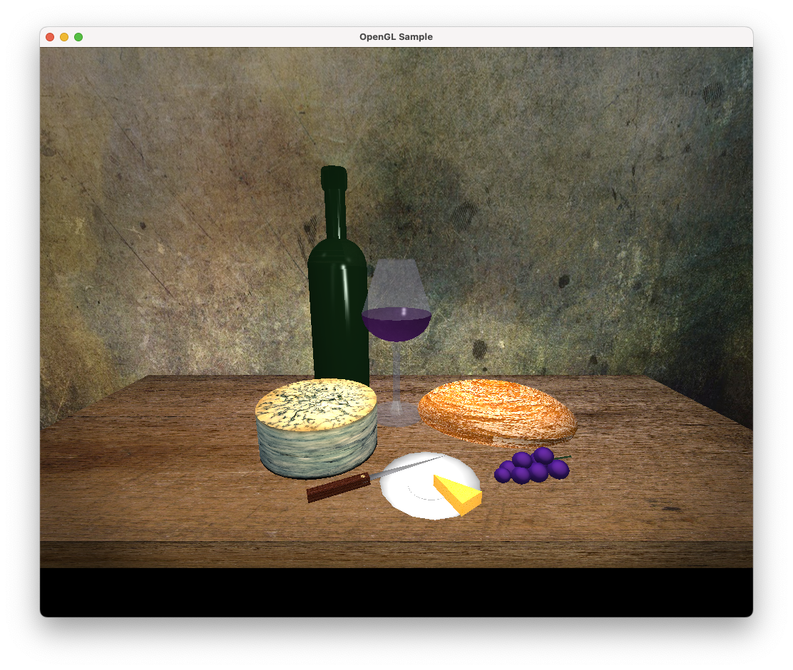

# CS-330 Journal

1. **How do I approach designing software?**
   - **What new design skills has your work on the project helped you to craft?** My recent OpenGL/C++ project helped me develop **3D scene organization** and **efficient memory management**. I learned how to structure classes in a way that facilitated **clean abstraction layers** between rendering logic and object management. One of the biggest skills I crafted was **shader programming**, which introduced me to new concepts like **vertex and fragment shaders** and how they interact with the pipeline. Additionally, I became adept at **problem-solving for graphical performance issues**, such as optimizing frame rates on mobile platforms.

   - **What design process did you follow for your project work?** I followed a **step-by-step design process** that began with **brainstorming** and gathering all necessary requirements. I then moved to the **high-level architectural design**, where I created flowcharts and diagrams to visualize the components. Afterward, I worked on **low-level designs**, such as class structures and method definitions. Throughout the process, I continuously refined the design based on **feedback and testing** to ensure alignment with the project goals. My focus was on iterative improvement and **user-centered design**, ensuring that the end-user experience was intuitive and engaging.

   - **How could tactics from your design approach be applied in future work?** The tactics I employed in this project, such as **modularity** and **iterative refinement**, can be applied to future work in many ways. Modular design, for instance, makes it easier to **reuse components** across different projects, while iterative design ensures that I can **adapt quickly to new requirements**. In future projects, I would continue to use **extensive testing** at each stage of development to reduce the chances of critical issues later on. Furthermore, the focus on **user experience** can be applied to make sure that even complex systems remain approachable and usable.
 ---

2. **How do I approach developing programs?** 
   - **What new development strategies did you use while working on your 3D scene?** One of the new development strategies I implemented during the project was **transforming raw geometry data into classes** that encapsulate the behaviors and attributes of objects, such as dumbbells and a pull-up bar. I also used **real-time debugging tools** to check OpenGL state changes, which helped in isolating and fixing errors quickly. Another strategy was the **use of texture mapping** combined with lighting effects, which allowed me to add realism to the scene by simulating different material properties.

   - **How did iteration factor into your development?** Iteration was central to my development process. I followed an **iterative approach** where I would design a feature, implement it, and then **refine it through multiple iterations** based on testing and feedback. This was especially true when dealing with **shaders and lighting** techniques; I would test different configurations to find the one that produced the most realistic effects. Iteration allowed me to continuously improve my project and respond to changing requirements without starting from scratch.

   - **How has your approach to developing code evolved throughout the milestones, which led you to the project’s completion?** My approach evolved from initially focusing on **getting things to work** to ensuring that the code was **clean, modular, and efficient**. Early in the project, I was more concerned with implementing features. However, as I moved through the milestones, I started placing more emphasis on **optimizing performance**, particularly when rendering complex 3D objects. I also grew more adept at **debugging shaders** and managing memory usage to avoid performance bottlenecks.
---
3. **How can computer science help me in reaching my goals?**
    - **How do computational graphics and visualizations give you new knowledge and skills that can be applied in your future educational pathway?** Computational graphics and visualizations have sharpened my skills in **mathematical modeling**, **spatial reasoning**, and **algorithm optimization**. These skills can be applied to a wide range of subjects in my educational journey, from **data science** to **artificial intelligence**. For example, understanding 3D transformations and rendering pipelines provides a solid foundation for further studies in **machine learning** and **simulation technologies**.

    - **How do computational graphics and visualizations give you new knowledge and skills that can be applied in your future professional pathway?** Professionally, the skills I have gained in **OpenGL** and **C++** development are invaluable for a career in **game development**, **simulation design**, or **augmented reality**. By learning how to efficiently manage and render complex 3D scenes, I have acquired the ability to create visually compelling and optimized graphics applications. Moreover, the practice of **real-time debugging** and performance optimization equips me to handle **resource-intensive applications** in any future role, ensuring that I am prepared for the challenges of high-performance computing.
